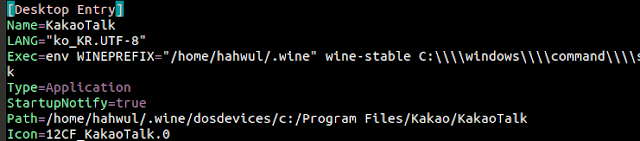

    wine을 통한 카카오톡 사용은 늘 호환성 이슈와 불안정성이 내재되어 있고,
    자신이 없으면 설치하기보단, 사용하지 않기를 권합니다. 저도 설치하다가
    우분투 한번 날려먹었습니다 ^^;;;

카카오톡 설치는 스프린트 진행과 관련이 없기 때문에 따로 질의응답을 진행하지 않습니다.\*\*

기존 블로그들도 잘 설명이 되어있지만, 약간 outdated 되어있습니다. wine 5.0 환경에서도 사용하실 수 있게 첨언을 해두었으니 확인하여 사용 부탁 드립니다.

와인 설치는, 공식 홈페이지의 안내를 따라서 해주시기 바랍니다.

**특히, 우분투 GUI (ubuntu software)를 활용한 설치 금지!!!!**

[WineHQ - Run Windows applications on Linux, BSD, Solaris and macOS](https://www.winehq.org/)

[Ubuntu](https://wiki.winehq.org/Ubuntu)

영어를 잘 모르겠다면, 간단한 번역을 해두었으니 따라서 설치해봅시다 :)

If you have previously installed a Wine package from another repository, please remove it and any packages that depend on it (e.g., wine-mono, wine-gecko, winetricks) before attempting to install the WineHQ packages, as they may cause dependency conflicts.

### 윈도우 관련, 이전 버젼 와인 모두 삭제

설치되어 있었던 와인 패키지나, 윈도우 호환성 관련 프로그램이 있다면 우선 모두 삭제합니다.

    sudo apt remove wine
    sudo apt remove wine-stable
    // ... 관련 페키지를 모두 삭제합니다 ...
    sudo apt autoremove --purge
    // ... 더이상 사용할 일이 없는 페키지를 모두 삭제합니다.

### 설치 전 환경설정

If your system is 64 bit, enable 32 bit architecture (if you haven't already):

아마 여러분의 컴퓨터는 특별한 경우가 아니면, 64bit입니다. (램이 4GB 이상인 경우)

아래의 명령을 실행시킵니다.

    sudo dpkg --add-architecture i386

### 설치 시작

와인 공식 리포지토리에 접근할 수 있는 키를 다운로드 받습니다.

    wget -nc https://dl.winehq.org/wine-builds/winehq.key
    sudo apt-key add winehq.key

와인 공식 리포지토리를, 패키지 업데이트 시 사용할 수 있도록 아래 리포지토리를 등록합니다. (우분투 18.04 기준 - 다른 버젼의 경우 공식문서 참고)

    sudo apt-add-repository 'deb https://dl.winehq.org/wine-builds/ubuntu/ bionic main'

- 참고) 위 방법으로 잘 되지 않는다면, 와인이 5.0로 업데이트 되면서 생긴 이슈인 FAudio가 제대로 설치되지 않아서 그럴 수 있습니다. 아래의 키를 받아서, 패키지 업데이트시 활용할 수 있도록 등록해주세요. 저는 아래의 포스트를 기반으로 작업을 진행했습니다.

  [FAudio for Debian and Ubuntu - WineHQ Forums](https://forum.winehq.org/viewtopic.php?f=8&t=32192)

  For Ubuntu 18.04

  아래의 링크에서, 키를 다운로드 받고 apt-key에 추가시킵니다.

  다운로드가 시작되지 않고 파일이 크롬에서 열린다면, 직접 파일을 생성하여 vim이나 nano로 키를 복사 붙여넣기 합니다. ( `touch Release.key` 이후 `nano Release.key` 혹은 `vim Release.key` 이후 복붙 )

  

        sudo apt-key add Release.key
        sudo apt-add-repository 'deb https://download.opensuse.org/repositories/Emulators:/Wine:/Debian/xUbuntu_18.04/ ./'

이후 업데이트를 실행합니다. 업데이트 시 기존에 보이던 주소 (...ubuntu.com...)가 아닌 위에서 추가했던 (wine, opensuse)등의 키워드가 있다면 업데이트 시 사용하는 리포지토리가 잘 등록된 것입니다.

    sudo apt update

이렇게 설정하면 앞으로 `wine-stable` 이 업데이트 될 때마다 적용될 것이기 때문에 추천드립니다.

### 설치 후 해야할 일

Wine이 성공적으로 설치되었을 경우, 다음 명령어를 이용하여 환경을 초기화 해주시기 바랍니다.

    $ WINEARCH=win32 WINEPREFIX=~/.wine wine wineboot

추가로 이 패키지도 설치 부탁 드립니다.

    sudo apt install cabextract

여기까지 하고 한번 재부팅을 해주시면 좋습니다.

### Winetricks를 설치하여 필요한 윈도우 프로그램 설치

winetricks는 와인을 좀 더 쉽게 다룰 수 있는 GUI 툴입니다. 설치해봅시다 !

    wget  https://raw.githubusercontent.com/Winetricks/winetricks/master/src/winetricks
    chmod +x winetricks
    ./winetricks --optout

위의 화면에서 [OK] 버튼을 클릭합니다. 그리고 다음과 같은 화면에서 [Install a Windows DLL or component]를 선택하여 [OK] 버튼을 클릭합니다.

다음 화면과 같이 설치할 패키지를 선택할 수 있는 화면이 나타납니다. 아래의 화면에서 gdiplus, riched30, wmp9, msxml6 패키지와 d3dx9_43를 설치합니다. 그리고 [OK] 버튼을 클릭하면 선택된 패키지가 설치되게 됩니다. 설치가 완료되면 실행된 Winetricks를 종료합니다.

여기서 아마 wmp9가 제대로 설치되지 않을건데, 에러 창이 뜨면 [https://web.archive.org/web/20180404022333/http://download.microsoft.com/download/1/b/c/1bc0b1a3-c839-4b36-8f3c-19847ba09299/MPSetup.exe](https://web.archive.org/web/20180404022333/http://download.microsoft.com/download/1/b/c/1bc0b1a3-c839-4b36-8f3c-19847ba09299/MPSetup.exe)

이 파일을 다운로드 받아서 winetricks에 넣어줘야 합니다 (.....)

`/home/{username}/.cache/winetricks/wmp9/MPSetup.exe` 이 자리로 넣어주시면 되는데요,

`mv` 명령어를 사용해서 옮깁시다. `mv MPSetup.exe ~/.cache/winetricks/wmp9/MPSetup.exe`

혹시 이미 이 파일이 있다면, 제대로 다운로드가 받아지고 있지 않은 것입니다. 그 파일을 지우고(`rm -rf ~/.cache/winetricks/wmp9/MPSetup.exe` ), 새로 받은 파일을 다시 이동시켜주세요 `mv MPSetup.exe ~/.cache/winetricks/wmp9/MPSetup.exe`

### 한글 폰트 설치

윈도우가 설치된 PC에서 C:/Windows/Fonts 디렉토리에서 gulim.ttf 한글 폰트를 복사한 뒤에 ~/.wine/drive_c/windows/Fonts에 복사합니다.

(저는 귀찮아서 인터넷에서 그냥 파일을 구해서 다운로드 받았습니다)

폰트의 퍼미션은 644으로 지정해 주셔야 합니다. `chmod 644 ~/.wine/drive_c/windows/Fonts` 그리고 ~/.wine/system.reg 파일을 엽니다.

    "MS Shell Dlg"="Tahoma"
    "MS Shell Dlg 2"="Tahoma"

위의 내용을 아래와 같이 수정합니다.

    "MS Shell Dlg"="Gulim"
    "MS Shell Dlg 2"="Gulim"

### 와인으로 카카오톡 설치하기

이제 드디어 카카오톡을 설치합니다.. -\_-

윈도우 xp 버젼 설정이 되어 있다면 아래 명령으로 받아주세요.

    wget http://app.pc.kakao.com/talk/win32/xp/KakaoTalk_Setup.exe

or 윈도우 7로 설정이 되어있다면.. 와인 5는 윈도우 7로 설정해놓고 해도 작동은 잘 합니다!

    wget http://app.pc.kakao.com/talk/win32/KakaoTalk_Setup.exe

약간의 사용 편의를 위해 Desktop 정보(Application) 을 등록해줍니다. Wine 디렉토리에 보면 이미 Desktop 파일이 구성되어 있는데, 아이콘이나 Language 등 필요한거 수정하시고

    cd .local/share/applications/wine/Programs/KakaoTalk/

    vim KakaoTalk.desktop

applications 로 넣어주시면 됩니다.

    cp KakaoTalk.desktop /usr/share/applications/

### Applications에서 카카오톡을 찾아서 실행해주시면 작동이 잘 됩니다!

### Reference

[Ubuntu](https://wiki.winehq.org/Ubuntu)

[우분투 18.04 에서 카카오톡 설치하기(Install kakaotalk on ubuntu 18.04)](https://www.hahwul.com/2018/08/install-kakaotalk-on-ubuntu-18.04.html)

[우분투 카카오톡 설치 - HiSEON](https://hiseon.me/linux/ubuntu/ubuntu-kakaotalk/)
